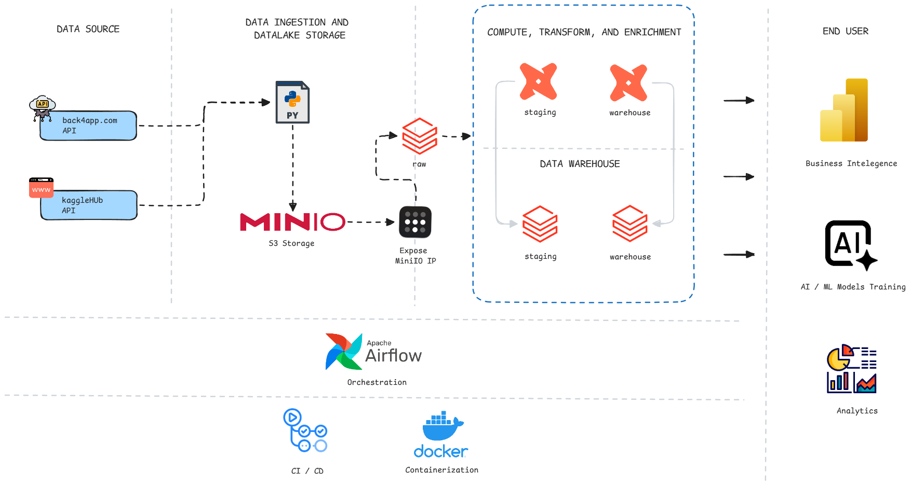

    
    

        <h1 style="display: inline-block; vertical-align: middle; margin-top: 0;">OLIST ECOMMERCE DATA WAREHOUSE WITH DBT</h1>
        

        

	<!-- Shields.io badges disabled, using skill icons. -->

        
Built with the tools and technologies:

        

        
        
        
        
        
        
         
        
        
	

    

## Project Overview

dbt-olist-ecommerce is an end-to-end data engineering pipeline built with Apache Airflow as main orcestrator and DBT as templating engine for data enrichment and transformation.
The project simulates a production-style data pipeline where raw API data is collected, stored, transformed, validated, and loaded into a relational data warehouse(Databricks). It demonstrates how modern data engineering systems orchestrate automated workflows, manage dependencies, and ensure data quality using containerized infrastructure.

### Background

The Olist E-commerce dataset is a rich, real-world dataset containing information on over 100,000 orders made at multiple marketplaces in Brazil from 2016 to 2018. It includes details on customer behavior, order status, payment methods, shipping logistics, and product attributes.

In a real-world enterprise environment, raw data like this arrives continuously and must be systematically ingested, cleaned, and modeled before it can be used for business intelligence (BI) or machine learning. This project bridges that gap by applying modern data stack principles to transform the raw Olist data into a structured, analytics-ready warehouse.

### Project Goal

The primary goal of this project is to build a robust, scalable, and automated batch-processing data pipeline. Specifically, this project aims to:

- Automate Data Ingestion: Seamlessly extract dataset files via API and route them into a local Data Lake (MinIO).
- Demonstrate ELT Best Practices: Decouple the extraction/loading phase from the transformation phase by leveraging Databricks for compute and dbt for modeling.
- Implement Data Quality Checks: Ensure data integrity, handle nulls, and enforce uniqueness through automated dbt testing.
- Showcase Infrastructure as Code: Use Docker and Docker Compose to easily spin up, replicate, and manage the local environment (Airflow, MinIO, Redis).

## What this project does

- Extraction: Airflow DAGs automatically download the latest Olist e-commerce dataset using the Kaggle API and temporarily store the CSV files locally.
- Data Lake Loading: The raw data is uploaded into MinIO (an S3-compatible object storage), acting as our landing zone/data lake.
- Data Warehouse Ingestion: The data is pushed from MinIO into the Raw layer of our Databricks Data Warehouse.
- Transformation (dbt): Airflow triggers dbt to execute SQL models that clean and transform the data:
- Staging Layer: Casts data types, standardizes column names, and handles missing values.
- Warehouse/Mart Layer: Joins tables (e.g., customers, orders, payments, reviews) to create wide, denormalized fact and dimension tables optimized for BI tools.
- Validation: dbt runs automated tests (e.g., checking for unique order_ids, ensuring accepted values for order statuses) at every layer to prevent bad data from reaching the final dashboards.

## Project structure

- `dags/` - Airflow DAG definitions (pipeline orchestration)
  - `dbt_staging.py` - Pipeline to enrich, load, and test data within staging layer in DWH
  - `dbt_warehouse.py` - Pipeline to enrich, load, and test data within warehouse layer in DWH
  - `extract_load_raw.py`- Pipeline for extracting data and load it into raw layer in DWH
- `dags/raw/` - Extract raw data from various API Calls
- `dags/warehouse/` - Logic for loading data from MiniIO to databricks and DWH init
- `include/dbt/` - DBT template and confirguration
- `data/` - Temporary placement for extracted data before loaded into MiniIO
- `docker-compose.yaml` - Local development stack (Airflow + MiniIO + Redis)
- `Dockerfile` - Image build definition
- `tests/` - Pytest-based unit + integration tests
- `docs/` - Project documentations

## Getting started

### Prerequisites

### Setup (local development)

### Running tests
